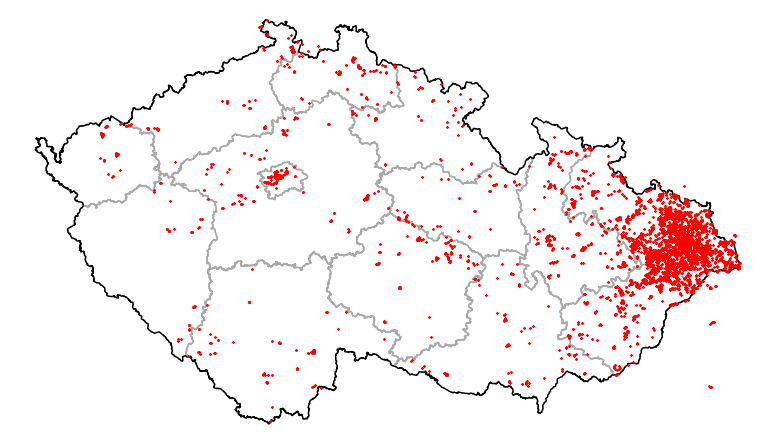

# gcfinds2map

Create a map image showing yours geocache finds.
A replacement for no more working "mapicky" from geocaching.cz

Implemented in python with geopandas library: https://geopandas.org



You will need your Geocache finds from pocket query.

Usage:
```shell
python gcfinds2map.py <my_finds_file> [out_file]
```

If no out file name is given, my_finds.png is used.

## Libraries

* geopandas
* folium
* matplotlib

## Note

GeoJSON files were generated from OpenStreetMap via overpass-turbo.

```
/*
This has been generated by the overpass-turbo wizard.
*/
[out:json][timeout:60];
// fetch area “Czechia” to search in
{{geocodeArea:Czechia}}->.searchArea;
// gather results
relation["boundary"="administrative"]["admin_level"="4"](area.searchArea);
// print results
out geom;
```
* admin_level = 2 is for Country contours
* admin_level = 4 is for Country divisions


